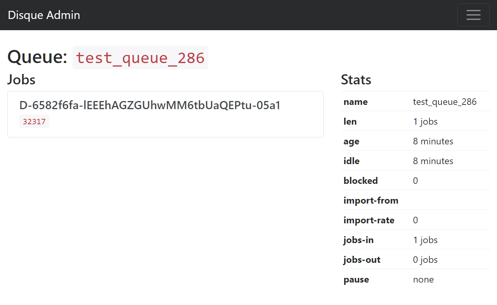
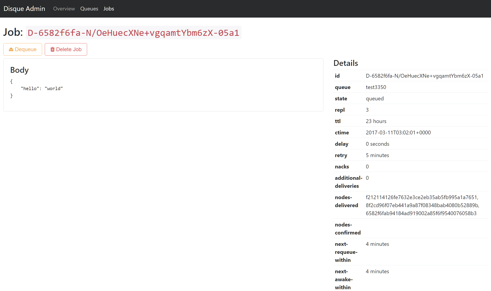

# DisqueAdminProvider

A web-based management/monitoring GUI for [Disque](https://github.com/antirez/disque)

## Dependencies

* Silex 2
* [Twig](TwigServiceProvider) support, with the twig bridge
* [Service Controller](http://silex.sensiolabs.org/doc/2.0/providers/service_controller.html) support
* [HTTP Fragment](http://silex.sensiolabs.org/doc/2.0/providers/http_fragment.html) support

## Getting Started

### Install and register the provider

1. `composer require varspool/disque-admin-provider`
2. Register the provider on your `$app`. The routes will be mounted for you at a configurable prefix:
    ```php
    $app->register(new \Varspool\DisqueAdmin\DisqueAdminProvider(), [
        // A prefix at which the admin routes will be mounted
        'disque_admin.mount_prefix' => '/_disque',
    ]);
   ```
3. Link (or serve, using your webserver configuration) the `resources/public` directory
    at the same prefix (using `try_files` for example, so we still fall back to PHP for missing paths).
    e.g.
    ```bash
    cd web && ln -s ../vendor/varspool/disque-admin-provider/resources/public _disque
    ```
### Configure connection

#### Configure single connection

You can use the following simple properties to configure a single connection:

* `disque_admin.host`: string, default '127.0.0.1'
* `disque_admin.port`: int, default 7711
* `disque_admin.password`: ?string, default null

#### Configure multiple connections

You can optionally configured multiple connections. Extend the `disque_admin.credentials` service
and replace it with an array of `Disque\Connection\Credentials` instances.

```php
$app->extend('disque_admin.credentials', function (Application $app) {
   return [
       new Credentials(
           '127.0.0.1,
           7711,
           $app['disque_admin.password'],
           $app['disque_admin.connect_timeout'],
           $app['disque_admin.timeout']
       ),
       new Credentials(
           '10.1.1.1',
           7712,
           $app['disque_admin.password'],
           $app['disque_admin.connect_timeout'],
           $app['disque_admin.timeout']
       ),
   ];
});

```

## Screenshots

* 
* 
